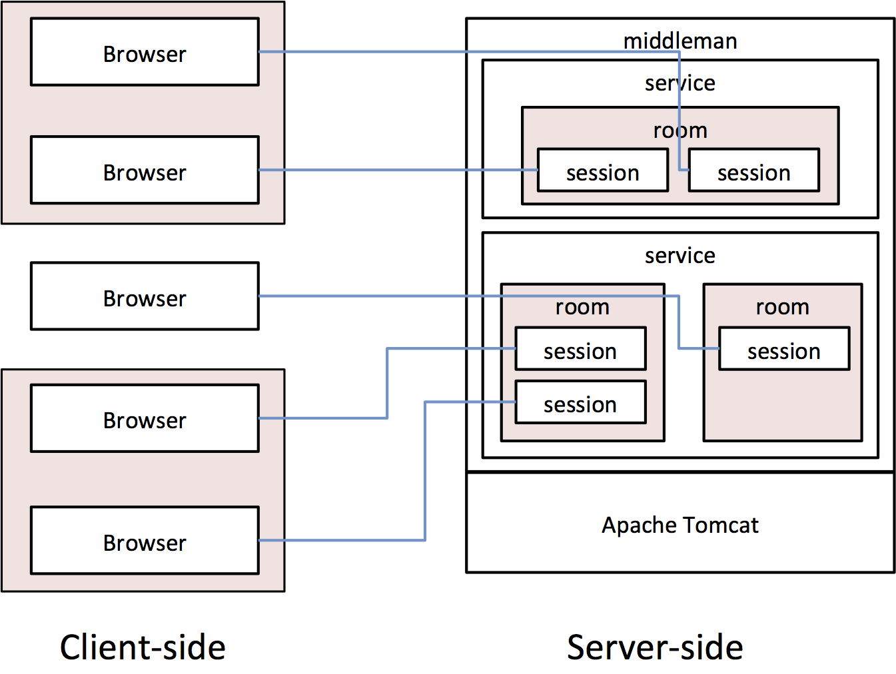

# middleman
WebSocketセッションサーバ

## middlemanとは

Javaで実装されたWebSocket用汎用セッションサーバです．同じルームIDを使用しているクライアント間のメッセージ配信を行います．

## 起動方法

このリポジトリをcloneし，Eclipseにimportして，Eclipse内からWebアプリケーションとして起動して下さい．
起動後， http://localhost:8080/middleman/ にブラウザでアクセスすると，簡単なチャットサンプルが表示されます．

## 利用方法(JavaScript)

JavaScriptに標準で用意されているWebSocketクラスを使います．
```
http://host:port/middleman/{serviceId}/{roomId}
```

上記URLに接続すると，同じ{roomId}を使用しているクライアント間でメッセージが送受信できます．
{serviceId}はサーバ側のサービス毎のIDです．
同じルームに参加しているクライアント間のブロードキャストのみサポートしているデフォルトサービスが用意されていて，
それを使う場合は"default"を指定します．

```JavaScript
var roomId = "ljrfkjsldflsjfslj";
var ws = new WebSocket("http://localhost:8080/middleman/default/" + roomId);
ws.onmessage = function (e) {
	console.log(e.data);
};
ws.onopen = function(){
	ws.send("hello");
};
```

## アーキテクチャ

middlemanは，サービス，ルーム，セッション(クライアントとの接続)を階層的に管理します．
サービスはチャットや共有キャンバス等のアプリケーション毎に，サーバ側の処理を担当するモジュールです．
ルームはサービスの中で，通信を共有するグループの処理を担当します．
middleman上に複数のサービスがあり，サービスは複数のルームを持ち，ルームは複数のセッションを管理します．


